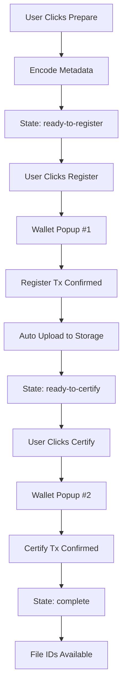

# Walrus SDK Integration Guide

## Overview

This project now uses the **official `@mysten/walrus` SDK** for decentralized storage instead of the legacy HTTP API. The new implementation uses a **flow-based approach** with separate wallet interactions to avoid browser popup blocking.

## Installation

```bash
yarn add @mysten/walrus
```

## Architecture

### Files Structure

- **`services/walrusSDK.ts`** - Official Walrus client configuration and helper functions
- **`hooks/useAgentFlow.ts`** - Flow-based agent registration hooks with separate steps
- **`hooks/useAgentSui.ts`** (legacy) - Old implementation, kept for reference

### Key Components

1. **WalrusClient** - Configured with upload relay for testnet
2. **WriteFilesFlow** - Step-by-step file upload process
3. **Separate Wallet Interactions** - Prevents popup blocking

## Usage Guide

### Method 1: Flow-Based Registration (Recommended)

For browser apps where wallet popups must be triggered by user actions:

```typescript
import { useAgentFlow } from './hooks/useAgentFlow';

function AgentRegistration() {
  const {
    state,
    error,
    fileIds,
    registerTxDigest,
    certifyTxDigest,
    prepareAgent,
    registerOnChain,
    uploadToStorage,
    certifyOnChain,
    canRegister,
    canCertify,
  } = useAgentFlow();

  // Step 1: Prepare metadata (no wallet popup)
  async function handlePrepare() {
    await prepareAgent({
      name: 'Agent Alpha',
      role: 'Data Analyst',
      description: 'Analyzes market data',
      capabilities: ['data-analysis', 'reporting'],
    });
  }

  // Step 2: Register on-chain (wallet popup #1)
  async function handleRegister() {
    const txDigest = await registerOnChain();
    console.log('Registered:', txDigest);
    // Upload happens automatically after this
  }

  // Step 3: Certify on-chain (wallet popup #2)
  async function handleCertify() {
    const txDigest = await certifyOnChain();
    console.log('Certified:', txDigest);
    console.log('File IDs:', fileIds);
  }

  return (
    <div>
      <button onClick={handlePrepare} disabled={state !== 'idle'}>
        Prepare Agent
      </button>
      <button onClick={handleRegister} disabled={!canRegister}>
        Register ({state})
      </button>
      <button onClick={handleCertify} disabled={!canCertify}>
        Certify
      </button>
      {error && <div>Error: {error.message}</div>}
    </div>
  );
}
```

### Method 2: Simple Registration (Quick & Dirty)

For non-production use with local storage fallback:

```typescript
import { useMintAgent } from './hooks/useAgentFlow';

function QuickRegistration() {
  const { mintAgent, isPending, isSuccess, txDigest } = useMintAgent();

  async function handleMint() {
    const digest = await mintAgent({
      name: 'Agent Beta',
      role: 'News Aggregator',
      description: 'Collects crypto news',
      capabilities: ['news-fetching'],
    });
    console.log('Minted:', digest);
  }

  return (
    <button onClick={handleMint} disabled={isPending}>
      {isPending ? 'Minting...' : 'Mint Agent'}
    </button>
  );
}
```

## Flow States

The `useAgentFlow` hook manages these states:

1. **`idle`** - Initial state, ready to prepare
2. **`encoding`** - Encoding metadata for Walrus
3. **`ready-to-register`** - Metadata encoded, ready for blockchain registration
4. **`registering`** - Waiting for wallet signature #1
5. **`uploading`** - Uploading to Walrus storage nodes
6. **`ready-to-certify`** - Upload complete, ready for certification
7. **`certifying`** - Waiting for wallet signature #2
8. **`complete`** - All done! File IDs available
9. **`error`** - Something went wrong

## Configuration

### Walrus Client Setup

Located in `services/walrusSDK.ts`:

```typescript
export const walrusClient = new WalrusClient({
  network: 'testnet',
  suiClient: suiClient,
  storageNodeClientOptions: {
    timeout: 60000, // 60 seconds
    onError: (error) => {
      console.error('Storage node error:', error);
    },
  },
  uploadRelay: {
    host: 'https://upload-relay.testnet.walrus.space',
    timeout: 60000,
    sendTip: {
      max: 1000, // Max 1000 MIST tip for priority upload
    },
  },
});
```

### System Configuration

In `config/suiWalletConfig.ts`:

```typescript
export const WALRUS_CONFIG = {
  uploadRelay: 'https://upload-relay.testnet.walrus.space',
  systemObjectId: '0x98ebc...1255c1',
  stakingPoolId: '0x20266a...35561d',
  epochs: 3, // Storage duration in epochs
  aggregator: 'https://aggregator.walrus-testnet.walrus.space',
};
```

## Why Flow-Based Approach?

### The Problem

Browsers block wallet popups that aren't triggered by direct user interactions. If you try to:
1. Upload data to Walrus
2. Register blob on-chain (popup)
3. Certify storage (popup)

...all in one async function, the browser will block popups #1 and #2.

### The Solution

Break the process into separate steps, each triggered by a button click:

1. **Prepare** (button 1) - Encode data locally, no popup
2. **Register** (button 2) - User clicks → wallet popup #1
3. **Upload** (automatic) - Happens after registration, no popup
4. **Certify** (button 3) - User clicks → wallet popup #2

This ensures each wallet popup is triggered by a direct user action.

## Transaction Flow



## API Reference

### `useAgentFlow()`

**Returns:**
- `state: FlowState` - Current flow state
- `error: Error | null` - Last error
- `fileIds: string[]` - Walrus file IDs (available after certification)
- `registerTxDigest: string | null` - Registration transaction digest
- `certifyTxDigest: string | null` - Certification transaction digest
- `prepareAgent(metadata): Promise<void>` - Encode metadata
- `registerOnChain(): Promise<string>` - Register blob (wallet popup)
- `uploadToStorage(): Promise<void>` - Upload to storage nodes
- `certifyOnChain(): Promise<string>` - Certify storage (wallet popup)
- `reset(): void` - Reset to idle state
- `canRegister: boolean` - True if ready to register
- `canCertify: boolean` - True if ready to certify

### `useMintAgent()` (Simplified)

**Returns:**
- `mintAgent(metadata): Promise<string>` - One-step registration
- `isPending: boolean` - Loading state
- `isSuccess: boolean` - Success state
- `error: Error | null` - Last error
- `txDigest: string | null` - Transaction digest

### Helper Functions

#### `uploadToWalrus(data, signer, options)`

Simple upload for server-side or CLI usage:

```typescript
const result = await uploadToWalrus(
  { message: 'Hello' },
  keypair,
  {
    identifier: 'hello.json',
    epochs: 3,
    deletable: true,
  }
);
console.log('Blob ID:', result.blobId);
```

#### `retrieveFromWalrus<T>(blobId)`

Retrieve data by blob ID:

```typescript
const data = await retrieveFromWalrus<MyDataType>('zaa1LYnJzLN...');
console.log(data);
```

## Cost Estimation

Storage costs depend on:
1. **Data size** - Larger data costs more
2. **Epochs** - Longer storage duration costs more
3. **SUI gas** - For registration and certification transactions
4. **WAL tokens** - For storage fees

Example costs (testnet):
- Small agent metadata (~1 KB): ~0.001 WAL + gas
- Medium data (~100 KB): ~0.1 WAL + gas
- Large data (~1 MB): ~1 WAL + gas

## Troubleshooting

### "Wallet popup was blocked"

**Solution:** Ensure each transaction (register, certify) is triggered by a direct user click, not from an async callback.

### "Transaction failed: No digest returned"

**Solution:** User may have rejected the transaction. Check the wallet popup and approve it.

### "Upload timeout"

**Solution:** Walrus testnet can be slow. The SDK has 60-second timeout configured. Try again or use local fallback.

### "Type mismatch: Transaction vs TransactionBlock"

**Solution:** This is a known issue. The code uses `as any` casts to bridge between `@mysten/sui` (new) and `@suiet/wallet-kit` (legacy). Will be fixed when Suiet updates.

## Migration from Legacy API

### Old Code (HTTP API)

```typescript
const result = await fetch('https://publisher.../v1/store?epochs=3', {
  method: 'PUT',
  body: blob,
});
```

### New Code (Official SDK)

```typescript
const results = await walrusClient.writeFiles({
  files: [file],
  epochs: 3,
  deletable: true,
  signer: keypair,
});
```

### Benefits

✅ Official SDK support  
✅ Better error handling  
✅ Upload relay (more reliable)  
✅ Automatic retries  
✅ Type safety  
✅ Separate wallet interactions (no popup blocking)

## Resources

- [Walrus Documentation](https://docs.walrus.space)
- [TypeScript SDK Docs](https://sdk.mystenlabs.com/walrus)
- [GitHub Examples](https://github.com/MystenLabs/ts-sdks/tree/main/packages/walrus/examples)
- [Testnet Faucet](https://faucet.walrus.space)
- [Explorer](https://testnet.suivision.xyz/walrus)

## Current Implementation Status

✅ Official Walrus SDK installed (`@mysten/walrus@0.8.4`)  
✅ WalrusClient configured with upload relay  
✅ Flow-based hooks (`useAgentFlow`)  
✅ Simplified hooks (`useMintAgent`)  
✅ Helper functions for upload/retrieve  
✅ Type safety and error handling  
🚧 Move contracts not yet deployed (using test transactions)  
🚧 Full agent lifecycle not yet implemented  

## Next Steps

1. Deploy Move contracts to get real `AGENT_PACKAGE_ID`
2. Test full registration flow with real wallet transactions
3. Implement agent NFT minting with Walrus metadata
4. Add cost estimation UI
5. Implement batch uploads for multiple agents
6. Add progress tracking for large uploads
